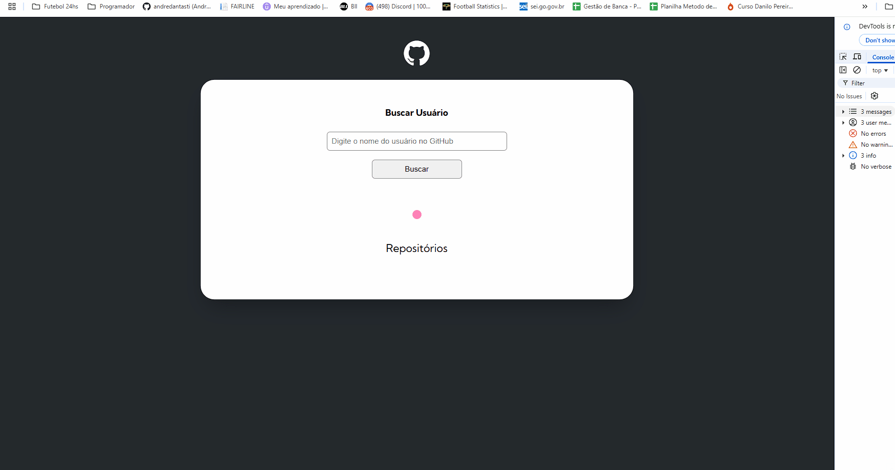

# projeto-inicial-fetch-github-api

## Índice

- [Overview](#overview)
  - [O Desafio](#O-Desafio)
  - [Screenshot](#screenshot)
  - [Links](#links)
- [My process](#my-process)
  - [Construído com](#Construído-Com)
  - [O que Aprendi](#what-i-learned)
  - [Continued development](#continued-development)
  - [Useful resources](#useful-resources)
- [Author](#author)

## Overview

### O Desafio

Os usuários devem ser capazes de:

- inserir o nome de uma usuário do Github e o mesmo retornar o nome, a foto do perefil(Avatar) a Bio caso tenha algo, e dez repositorios com o link;

- os repositorios iram se tornar botões, o quais darão acesso direto a esses repositorios

### Screenshot

### Links

- Solution URL: (https://andredantasti.github.io/desafio-api-github/)

## My process

### Construído com

- Semantic HTML5 markup
- CSS custom properties
- Flexbox
- CSS Grid - Autofill
- Media Querye
- Javascript
- Api Github

### O que Aprendi

- Neste projeto foi trabalhado especificamente a parte de Javascript, para puxar os dados da Api do Github, utilizando metodos Async...await, fetch; Utilização também dop try..catch para tratar erros, entre outros metodos.

### Desenvolvimento Contínuo

Continuar a práticar e aprender cada vez mais sobre o HTML, CSS e Javasript, bem como novas tecnologias que veremos durante o curso.

### Useful resources

None

## Author

- Website - [Andre Dantas](https://github.com/andredantasti)
- Frontend Mentor - [@andredantasti](https://www.frontendmentor.io/profile/andredantasti)
- Instagram - [@andredantasti](https://www.instagram.com/andredantasti)
- Linkedin - [Andre Dantas](https://www.linkedin.com/in/andre-dantas-84b370366/)